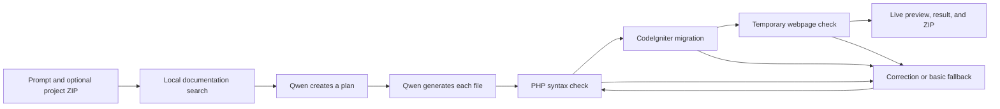

# PHP Vibe Coder

PHP Vibe Coder is a beginner-friendly local coding agent for small CodeIgniter 4 applications. A user describes an application in a Streamlit interface, and the agent retrieves relevant local documentation, asks a small local language model to generate the required files, runs the code, and attempts to repair errors.

Everything runs locally. The application does not send prompts or source code to a hosted AI API.

## What it does

- Accepts a plain-English application request in Streamlit.
- Optionally imports an existing CodeIgniter project ZIP so the model can understand and update it.
- Searches locally downloaded PHP, CodeIgniter, Composer, MySQL, and OWASP documentation.
- Includes project coding standards and beginner-friendly design patterns in vector search.
- Uses `Qwen/Qwen2.5-Coder-0.5B-Instruct` for planning and code generation.
- Generates a small CodeIgniter project with controllers, models, views, routes, and migrations.
- Avoids PHP type declarations in generated application files.
- Checks generated PHP files with `php -l`.
- Runs CodeIgniter migrations against a local MySQL database.
- Starts the generated website temporarily and checks that the home page responds.
- Keeps a successful generated website running in an embedded live Preview tab.
- Provides a button that opens the preview in a separate browser tab.
- Generates responsive CSS and small dependency-free JavaScript alongside PHP and HTML.
- Allows one, two, or three LLM-based correction attempts when generated code fails.
- Optionally runs route, frontend-asset, and homepage smoke tests without PHPUnit.
- Optionally adds an Nginx example and a short deployment guide.
- Uses a simple deterministic scaffold if the model still cannot produce working code.
- Displays the generated files, retrieved documentation, runtime output, and a downloadable ZIP.

This is an educational local project generator, not a production deployment system. It has no Docker setup, hosted API, TensorFlow training pipeline, or automated test framework.

## How it works



The documentation indexer reads downloaded files from `docs/`, optional local notes from `knowledge/`, and maintained project guidance from `rag_sources/`. It then:

1. Reads `.html`, `.htm`, `.md`, and `.txt` files from those source folders.
2. Removes HTML navigation, scripts, styles, headers, and footers.
3. Splits text into approximately 1,600-character chunks with a small overlap.
4. Creates embeddings with `sentence-transformers/all-MiniLM-L6-v2`.
5. Stores the chunks and embeddings in a local Chroma database.

For each prompt, the vector store retrieves 12 candidates, combines semantic similarity with keyword overlap, and gives the best five sections to Qwen. The plan is limited to 12 application files to leave room for CSS and JavaScript while keeping generation manageable on a laptop.

## Requirements

- Python 3.9 or newer
- PHP 8.2 or newer
- Composer
- MySQL
- Git
- A few gigabytes of free disk space for Python packages, models, documentation, generated projects, and the vector database

The current local setup has been verified with PHP 8.5, Composer 2.10, MySQL 9.7, and CodeIgniter 4.7.

## Installation

### 1. Clone the repository

```bash
git clone YOUR_GITHUB_REPOSITORY_URL
cd PHP-Vibe-Coder
```

Replace `YOUR_GITHUB_REPOSITORY_URL` with the URL of your published repository.

### 2. Create the Python environment

```bash
python3 -m venv .venv
source .venv/bin/activate
python -m pip install --upgrade pip
python -m pip install -e .
```

On Windows PowerShell, activate the environment with:

```powershell
.venv\Scripts\Activate.ps1
```

### 3. Download the local models

The application deliberately uses offline-only model loading. Download both models once while internet access is available:

```bash
hf download Qwen/Qwen2.5-Coder-0.5B-Instruct
hf download sentence-transformers/all-MiniLM-L6-v2
```

The first model plans and generates CodeIgniter code. The second model creates embeddings for documentation search. They are stored in the Hugging Face cache outside this repository and are not pushed to GitHub.

### 4. Install the CodeIgniter runtime

The template's `vendor/` directory is intentionally excluded from GitHub. Recreate it with Composer:

```bash
cd templates/codeigniter-base
composer install --no-dev
cp env .env
cd ../..
```

Only runtime packages are installed. The project does not include PHPUnit, Faker, or other test-only dependencies.

### 5. Configure MySQL

Start MySQL and create the database used by generated projects:

```sql
CREATE DATABASE php_vibe_coder
CHARACTER SET utf8mb4
COLLATE utf8mb4_unicode_ci;
```

Edit `templates/codeigniter-base/.env` and provide the local connection settings:

```ini
CI_ENVIRONMENT = development

database.default.hostname = localhost
database.default.database = php_vibe_coder
database.default.username = root
database.default.password =
database.default.DBDriver = MySQLi
database.default.port = 3306
```

The `.env` file is local and ignored by Git. Do not commit database passwords.

## Documentation and RAG setup

Downloaded documentation, local knowledge notes, and the generated vector database are excluded from GitHub. Obtain documentation only from the official sources below.

| Folder | Official source | What to add |
|---|---|---|
| `docs/php/` | [PHP documentation downloads](https://www.php.net/download-docs.php) | Extract the English many-files HTML manual. |
| `docs/codeigniter/` | [CodeIgniter 4 user guide](https://github.com/codeigniter4/userguide) | Copy the published HTML files from `docs/`. |
| `docs/composer/` | [Composer documentation](https://github.com/composer/composer/tree/main/doc) | Copy the Markdown files from `doc/`. |
| `docs/mysql/` | [MySQL 9.7 reference manual](https://dev.mysql.com/doc/refman/9.7/en/) | Save the relevant manual pages as HTML. |
| `docs/security/` | [OWASP Cheat Sheet Series](https://github.com/OWASP/CheatSheetSeries) | Copy relevant Markdown files from `cheatsheets/`. |

Use this folder structure:

```text
docs/
├── php/
├── codeigniter/
├── composer/
├── mysql/
└── security/
```

The indexer does not currently read PDF files. The downloadable MySQL PDF will be ignored unless PDF support is added later, so use saved HTML pages instead.

Build the local vector database after adding or changing documentation:

```bash
python scripts/build_document_index.py
```

The index is written to `storage/vector_database/`. Building the complete PHP manual can take time because it contains thousands of pages. The finished database is reusable and only needs to be rebuilt when the documentation changes.

The repository includes two small sources that are indexed automatically:

- `rag_sources/coding-standards.md` explains the expected CodeIgniter structure, security rules, and frontend conventions.
- `rag_sources/design-patterns.md` explains MVC, model boundaries, service layers, validation, Post/Redirect/Get, and migrations.

## Running the application

Make sure MySQL is running, activate the Python environment, and start Streamlit:

```bash
source .venv/bin/activate
python -m streamlit run app.py
```

Streamlit normally opens the interface at [http://localhost:8501](http://localhost:8501).

Try a small prompt first:

```text
Create a small CodeIgniter product list with product name and price stored in MySQL.
```

Generation can take a minute or more because the model runs on the CPU and creates each file separately.

### Optional build settings

Open **Optional build settings** beneath the prompt to configure a generation:

- **Existing CodeIgniter project ZIP** copies an existing project's usable files into a new job workspace. It ignores `.git`, `.env`, dependencies, logs, and caches. It rejects unsafe paths, symbolic links, more than 1,000 files, or more than 30 MB of extracted data. The original ZIP and original project are never modified.
- **Maximum AI repair attempts** selects one, two, or three repair passes. Each pass reads the latest errors and regenerates only the likely affected files.
- **Run optional minimal tests** checks registered routes, the required CSS and JavaScript files, and the homepage. It does not install PHPUnit.
- **Add lightweight deployment files** adds `DEPLOYMENT.md` and `deploy/nginx.conf`. Local generation and preview do not depend on them.

For an uploaded project, describe the change rather than the whole application:

```text
Add a search box to the uploaded product list and keep its existing layout.
```

## Understanding the result

The interface reports one of three statuses:

- `working`: PHP syntax passed, migrations ran, and the generated webpage responded successfully.
- `environment_error`: code was generated, but PHP, Composer, MySQL, a port, or another local dependency prevented execution.
- `could_not_fix`: generation and correction completed, but code errors remain.

Generated projects are stored under:

```text
storage/jobs/JOB_ID/project/
```

The Streamlit ZIP excludes `vendor/`, `.env`, logs, and caches. Run `composer install --no-dev` and create an `.env` file after extracting a downloaded project elsewhere.

The Preview tab embeds the working generated webpage. Its button can open the same page in a separate browser tab. The preview uses an available local port and remains active while Streamlit is running. Generating another project stops the previous preview.

## Project structure

```text
PHP-Vibe-Coder/
├── app.py                              Streamlit interface
├── php_vibe_coder/
│   ├── llm.py                          Offline Qwen loader and generation
│   ├── vector_store.py                 Chroma retrieval and reranking
│   ├── simple_agent.py                 Planning, generation, repair, fallback
│   ├── project_archive.py              Safe existing-project ZIP extraction
│   └── runner.py                       Runtime checks and persistent preview server
├── scripts/
│   └── build_document_index.py         Documentation parser and index builder
├── templates/
│   └── codeigniter-base/               Reusable CodeIgniter starter project
├── docs/                               Local documentation, ignored by Git
├── knowledge/                          Optional local notes, ignored by Git
├── rag_sources/                        Versioned standards and design patterns
├── storage/
│   ├── vector_database/                Generated Chroma index, ignored by Git
│   └── jobs/                           Generated projects, ignored by Git
├── pyproject.toml                      Python package and dependencies
└── .gitignore                          Local and generated file exclusions
```

## Error correction

After generation, the agent checks framework conventions and PHP syntax. It then runs:

```bash
php spark migrate
php spark serve --host 127.0.0.1 --port AVAILABLE_PORT
```

If code fails, the agent asks Qwen to repair the likely affected files up to the selected limit. It validates and reruns the project after every attempt. If errors remain, it replaces the planned application files with a small predictable scaffold and checks again. Database connection failures and missing local programs are reported as environment errors because changing generated PHP cannot fix them.

Optional minimal-test failures participate in the same loop, so a route, asset, or homepage failure can trigger a repair.

## Troubleshooting

### The model cannot be found

The code uses offline-only loading. Activate the virtual environment and download both models:

```bash
hf download Qwen/Qwen2.5-Coder-0.5B-Instruct
hf download sentence-transformers/all-MiniLM-L6-v2
```

### The documentation index has not been built

Confirm that supported files exist under `docs/`, `knowledge/`, or `rag_sources/`, then run:

```bash
python scripts/build_document_index.py
```

### CodeIgniter cannot find `vendor/autoload.php`

Install the template's runtime packages:

```bash
cd templates/codeigniter-base
composer install --no-dev
```

### MySQL cannot connect

Check that MySQL is running, the `php_vibe_coder` database exists, and the settings in `templates/codeigniter-base/.env` are correct. Also confirm that PHP has the `mysqli` extension enabled.

### Generation is slow

The model is intentionally small but still runs locally on the CPU. Close memory-heavy applications and begin with a request that needs only a few files.

## Current limitations

- The small model can misunderstand complex or vague prompts.
- Plans are limited to 12 generated application files.
- Only the most recently generated working project has an active live preview.
- Generated projects share the configured local MySQL database.
- The fallback scaffold focuses on simple database lists rather than complex authentication or business logic.
- The optional tests remain deliberately small; they do not submit every form or exercise every route.
- Generated authentication, authorization, payments, uploads, and other sensitive features require manual security review.
- PDF documentation is not indexed.
- Deployment output is a starting point and still requires server-specific values, HTTPS, security review, and operational setup.

## Files intentionally excluded from GitHub

The repository keeps source code and lightweight configuration only. `.gitignore` excludes:

- Python virtual environments and caches
- Downloaded documentation and local knowledge files
- Hugging Face models and caches
- The Chroma vector database
- Generated projects and ZIP output
- CodeIgniter `vendor/`, `.env`, logs, cache, sessions, and uploads
- Streamlit secrets and editor files
- Local databases, archives, and model-weight files

These files remain available locally but must be installed, downloaded, or generated after cloning the repository.
